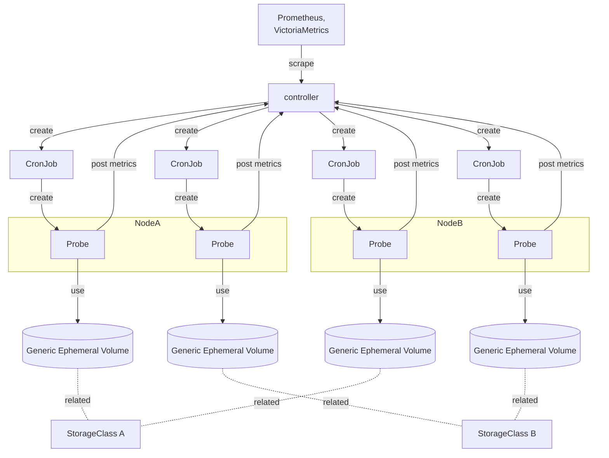

# Design notes

## Motivation

You cannot tell if you can successfully create PVs via the storage plugin until you try to create PVs.
So users may only notice the failure when they try to create PVs.

To avoid such a situation, the storage administrator should be aware of the problem before users realize it.

## Goal

- Verify that the storage driver is working properly
- Verify that the PV can be accessed
- Check for all specified StorageClasses
- Also check the storage plugin that creates node-local volumes on the specified node (e.g. TopoLVM)
- Output the monitoring results as Prometheus metrics

## Architecture

### How pie works

pie works as follows:

1. The controller creates CronJobs for each node and StorageClass.
2. A CronJob periodically creates a probe pod.
3. A Probe pod requests to create a Generic Ephemeral Volume via the related StorageClass.
4. The controller monitors the pod creation events and measures how long it takes to create probe pods.
   (This indirectly measures the time required for volume provisioning.) Then it exposes the result as Prometheus metrics.
5. Once the prob pods are created, they try to read and write data from and to the Generic Ephemeral Volume, and measure the I/O latency. Then they post the result to the controller.
6. When the controller receives the requests from the probe pods, it exposes the result as Prometheus Metrics.

### Metrics design decision

As explained in [README.md](../README.md#prometheus-metrics), metrics related to PV creation are output in the form of whether the PV creation was completed within a certain time (`create_probe_fast_total` or `create_probe_slow_total`), not the time taken for the creation.

If you try to output the time taken to create a PV, the metrics would not be output until the PV is actually created.
Then, if the PV cannot be created due to some problems, the metric would not be output, and
you would not realize that there are some problems.

Therefore, if the PV is not created within a certain time, `create_probe_slow_total` counter is incremented so that you can notice the problem even when the PV creation is completely stopped.
