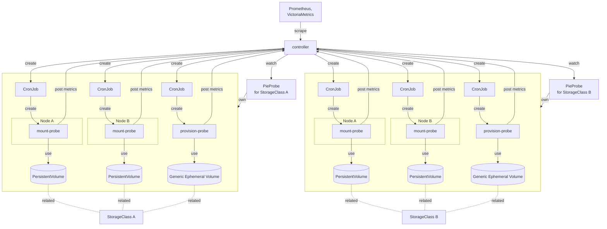

# Design notes

## Motivation

You cannot tell if you can successfully create PVs via the storage plugin until you try to create PVs.
So users may only notice the failure when they try to create PVs.

To avoid such a situation, the storage administrator should be aware of the problem before users realize it.

## Goal

- Verify that the storage driver is working properly
- Verify that the PV can be accessed
- Check for all specified StorageClasses
- Also check the storage plugin that creates node-local volumes on the specified node (e.g. TopoLVM)
- Output the monitoring results as Prometheus metrics

## Architecture

There are following two types of probes:
- provision-probe, which checks that a new provision succeeds; and
- mount-probe, which checks that a PV (possibly already provisioned) can be successfully mounted on each Node.

PieProbe custom resource is used to group the probes that monitor a StorageClass.
Each probe has an owner reference to a PieProbe and is GCed when the referenced PieProbe is deleted.
See also issue [#50](https://github.com/topolvm/pie/issues/50).

Each probe works as follows:
- provision-probe:
  1. The controller creates a provision-probe CronJob for each PieProbe.
  2. The CronJob periodically creates a provision-probe Pod.
  3. The Pod requests the creation of a Generic Ephemeral Volume via the related StorageClass.
  4. The controller monitors the Pod creation events and measures how long it takes to create the Pod.
  (This indirectly measures the time required for provisioning the volume.) Then it exposes the result as Prometheus metrics.
  5. Once the provision-probe Pod is created, it immediately exits normally. 
- mount-probe:
  1. The controller creates a mount-probe CronJob and a PVC for each Node and PieProbe.
  2. The CronJob periodically creates a mount-probe Pod.
  3. If the PVC is not yet bound, the Pod requests to provision a PV via the related StorageClass. Then, the Pod mounts the PV.
  4. The controller monitors the Pod creation events and measures how long it takes to create the Pod.
  (This indirectly measures the time required for mounting the volume.) Then it exposes the result as Prometheus metrics.
  5. Once the Pod is created, it tries to read and write data from and to the PV, and measures the I/O latency. Then it posts the result to the controller and exists normally.
  6. When the controller receives the request from the mount-probe Pod, it exposes the result as Prometheus metrics.

### Metrics design decision

As explained in [README.md](../README.md#prometheus-metrics), metrics related to PV creation are output in the form of whether the PV creation was completed within a certain time (denoted as `on_time` label of `provision_probe_total`), not the time taken for the creation.

If you try to output the time taken to create a PV, the metrics would not be output until the PV is actually created.
Then, if the PV cannot be created due to some problems, the metric would not be output, and
you would not realize that there are some problems.

Therefore, if the PV is not created within a certain time, `provision_probe_total` counter with `on_time=false` is incremented so that you can notice the problem even when the PV creation is completely stopped.

The same goes for `mount_probe_total`, which similarly has the `on_time` label.
